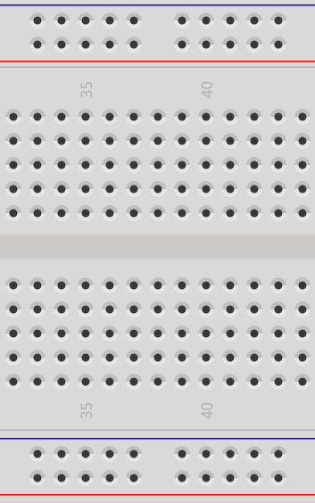
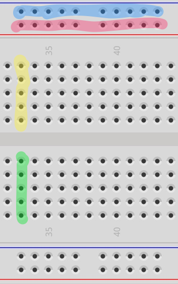

  

 
  

  

    A <b>breadboard</b> has many connections that we can use for temporarily connecting electrical components together. It is where we always begin our explorations when building new circuits.
  

  

 
  

  

    The highlights in the image at left show which holes are electrically connected in the breadboard. 
    
    <ul class="top-buffer">
    <li>All of the holes highlighted in <b>blue</b> are connected</li>
    <li>All of the holes highlighted in <b>pink</b> are connected</li>
    <li>All of the holes highlighted in <b>yellow</b> are connected</li>
    <li>All of the holes highlighted in <b>green</b> are connected</li>
  </ul>
  
  
The <b>blue</b> holes are often referred to as the <b>ground rail</b>. The pink holes are often referred to as the <b>power rail</b>. (The "rails" run along the edges of the board.) What this means is that we try, every time we build a circuit, to connect the voltage source (like a battery) for our circuit to the power rail. This way, every time we plug a wire into the red rail, we know we will be connected to a voltage source. Similarly, we always connect the ground (or, in the case of batteries, negative) side of our circuit to the blue rail. This way, know we can ground our circuit by connecting wires to the blue rail.
  

  
  

    We use the rows (green and yellow) for prototyping our circuit, and we typically put integrated circuits (or chips) across the gutter (the space in the middle that separates the rows).
   

  
  

