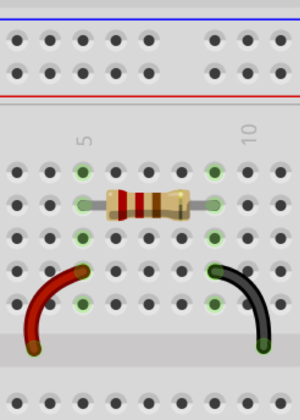
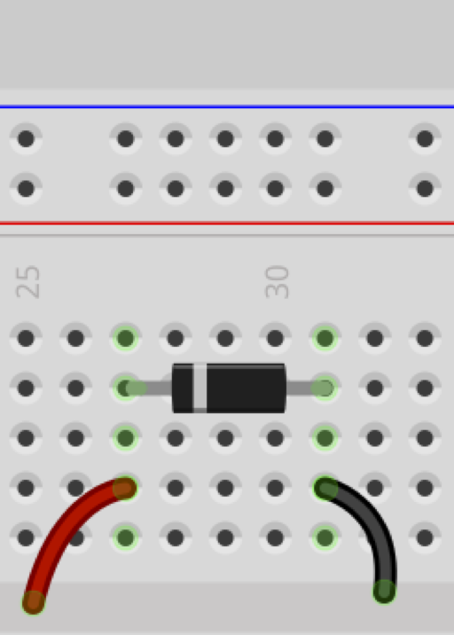
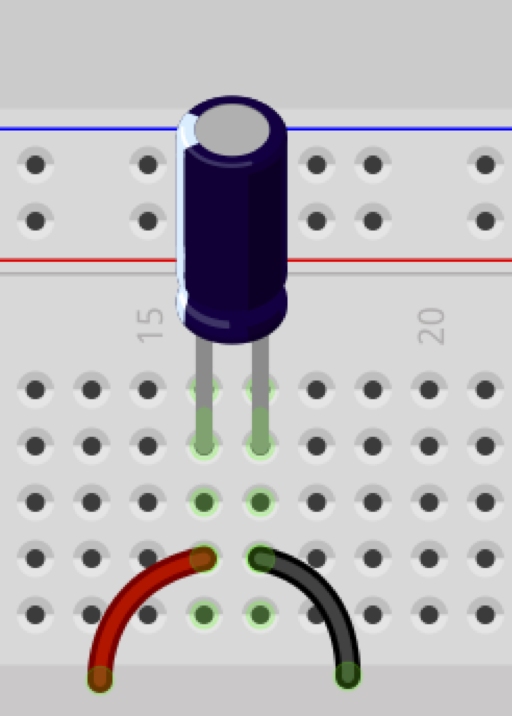
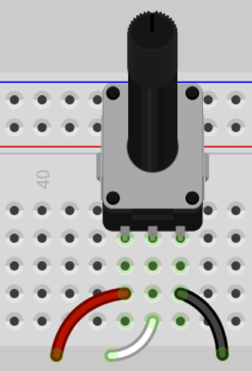

### Activity and Purpose

We're going to practice testing  continuity with a multimeter, and grow comfortable working with the multimeter for checking different electrical components.

### Setup

Strip two ends of about 8" of wire. On one end, strip approximately 1/4". On the other end, strip roughly 1". Make two of these.

Then, wrap the 1" end around each of the probes of your multimeter.

### Observations

We're now going to test a variety of common electronics components for continuity. Which of them block a complete circuit, and which of them allow current to flow through them?

In each case, insert the component into your breadboard and test all of the possible connection points. For the potentiometer, be sure to check all possible combinations of the three wires (red/black, white/black, red/white).

Record your observations in your notebook.

  

    <h3>Resistor</h3>
  
  

  

    <h3>Diode</h3>
  
  

  

    <h3>Capacitor</h3>
  
  

  

    <h3>Potentiometer</h3>
  
  

  

    <h3>LED</h3>
  
  

&nbsp;

<!-- 
The video introduced you to the basics of breadboards and a multimeter (when used for checking continuity).

### Observe

Use your multimeter to check the continuity of at least ten to fifteen objects around you.

### Record

Record your observations for each of those objects. 

* What is the object you tested?

* What did the multimeter do?

### Hypothesize

We know that the multimeter, in continuity testing mode, tells us if there is a complete circuit from one probe to the other. 

1. For which objects did claim there was a good circuit? Were you surprised? Why or why not?

1. Which objects did it say there was no circuit? Were you surprised? Why or why not?

What is your theory as to why it works for some of these objects, but not for others?
-->