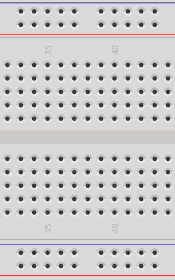
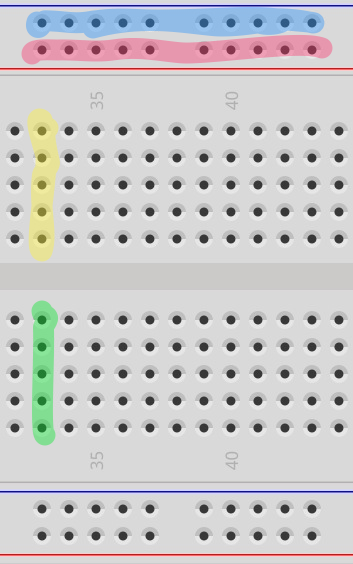

  

 
  

  

    A breadboard has many connections that we can use for temporarily connecting electrical components together.
  

  

 
  

  

    The highlights in the image at left show which holes are electrically connected in the breadboard. 
    
    <ul class="top-buffer">
    <li>All of the holes highlighted in <b>blue</b> are connected</li>
    <li>All of the holes highlighted in <b>pink</b> are connected</li>
    <li>All of the holes highlighted in <b>yellow</b> are connected</li>
    <li>All of the holes highlighted in <b>green</b> are connected</li>
  </ul>
  
  

