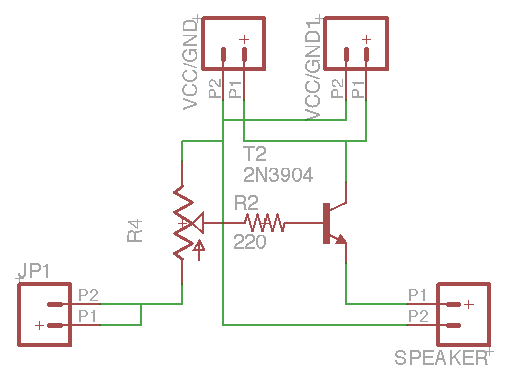
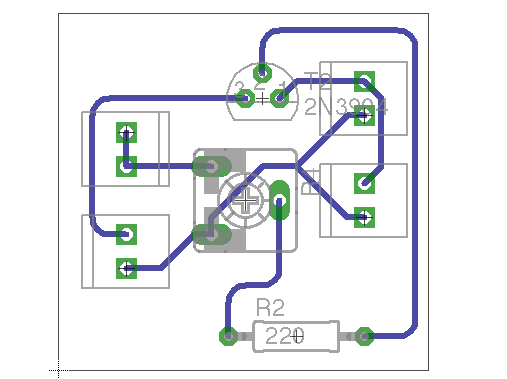

## Requirements

I believe I understand the requirements of the Wooden Piano Project. I have not seen the piano in its constructed/final configuration, nor have I seen a circuit diagram for how it is currently wired. Therefore, I'm working (primarily) from my own understanding of what I think would need to be done for this project to work.

It must be verified by the people who built the piano. Doing a face-to-face, with the piano in front of us, and making sure these components are correct/complete would be a good idea.

The wooden piano needs to:

1. **Have an on/off switch**. I do not know if this should be easily accessible or difficult to access. I remember discussion about the switch, but did not make note of how it should be mounted/configured.

1. **Power LED**. We should know if it is on. Again, this 

1. **Have a volume control**. It was unclear how loud the piano needed to be. My concern is that a speaker, driven directly by the Arduino, will be too quiet. A one-transistor amplifier design has been included, which provides a bit more volume at minimal cost/complexity.

1. **Be easily maintained/repaired**. The amplifier adds to the complexity of the circuit, but it might be necessary. Either way, this will be determined by the routing/labeling/assembly as anything else.

# Components

## Arduino

[Arduino Pro Mini 5V](https://www.sparkfun.com/products/11114). We'll work at 5V, because we don't have time to re-prototype the circuit at 3V. 

  

## Power Supply

To make things a bit easier, we'll use 3, AA batteries and a 5V DC-DC step-up converter. If we don't do this, the alternative is that we use more than 7V, and let the Arduino step it down... which is very inefficient.

### 5V Step-Up

This takes in between 1V and 4V, and steps it up to 5V, and can support up to a 200mA current draw.

  

### Batteries

We could use two or three batteries with the step-up. I'd like to see us do an endurance test with both two batteries and three, as I don't have a good sense for what the lifetime on the piano will be in any configuration we might choose at this point.

* [Three cell AA battery pack with switch](https://www.sparkfun.com/products/10891)

  

* [Two cell AA battery pack with switch](https://www.sparkfun.com/products/9547)

  

## LED and Holder

As stated above, I cannot remember if we needed the power switch to be hidden, or if the switch with LED (below) would be adequate. If we just want an LED poking out a tiny bit, then we need LED holders and 5mm LEDs (which I believe I have lots of). 

* [LED holder](https://dlnmh9ip6v2uc.cloudfront.net/images/products/1/1/8/4/0/11840-02_medium.jpg)

## Switch

If we can get away with just an internal switch, the the switches built into these battery holders are the way to go. I don't have a good sense right now for how long 2AA vs 3AA will last. If we could get away with 2AA batteries for practical usage, it would be better... based mostly on the premise that batteries tend to be sold in *even* quantities, and chargers tend to work on two or four batteries, not three...

* [Switch with LED](https://www.sparkfun.com/products/11155)

  

## Wiring

We'll order bulk wire in a variety of colors. 22 gauge, solid core. 1000' spools.

* [Bulk Wire](http://www.bulkwire.com/wire-cable/solid-hookup-wire-300v-ul-1007-1569.html)

## Micro Switches

Lady Ada charges $1.50 each for these. We need 8 x 5 = 40 switches. In lots of 10 at $6.50, we'd rather pay $0.65 each. These aren't identical to the switches that were used in the prototype, but we just need a NO micro switch. These should, as far as I can tell, be just fine.

* [Micro Switches](http://www.ebay.com/itm/10-pc-TEMCo-Micro-Limit-Switch-Lever-Arm-Subminiature-SPDT-Snap-Action-LOT-/281125065776?pt=LH_DefaultDomain_0&hash=item41745c1430)

  

Hm. This seller has them in quantities of 50 and 100 as well. A 50-count pack is $30, which is the way to go. Note that these are only good for roughly 30,000,000 actuations.

## Speakers

We'll use the 3" speakers from Adafruit; I can't casually find a better price, and they've got nice mounting tabs.

* [3" 8ohm 1W speaker](http://www.adafruit.com/products/1313)

  

## Amplifiers

We can cut some amplifiers on the PCB mill. I built one on the breadboard; it makes a big difference in the output volume. Instead of sourcing the voltage and current for the speaker from the Arduino itself, we tap directly into VCC, and toggle that through a transistor with the signal pin. The 10K trimpot gives us a volume control.

It's not exceedingly usable as a volume control (buried under the piano), but we will assume that once the volume is set where the teacher wants it, they won't be fiddling with it constantly.

We need two of these per piano, I think. Or, we can drive both speakers off one (which I would like to prototype before we do the production run). We have all of the components in-house for this. (2N3904 transistors and trimpots in abundance).

  

  

## Miscellaneous

Screw terminals make our life easier for wiring. There will be no soldering on the Arduino; we'll only have to solder to the switches. Or, put another way:

* We solder long wire leads onto the micro switches.
* We solder long leads onto the LED.
* We solder long leads onto the speakers.

Once we've done that, we can simply plug the wire into the screw terminals on the Arduino and the amplifiers. It eliminates many solder joints, makes repair/update easier, and basically means that individual components can be more easily replaced in the event of damage. (That is, we don't have to de-solder lots of connections if something goes wrong with the Arduino.)

  

I've never done this, but it looks like it can be done. There are 12 pins down each side of an Arduino Mini Pro. We'll need four, 3-pin terminals for each side of the Arduino. Plus, we'll need ... three, 2-pin terminals for each of the amps. I think that's all. (I'll look for these bulk on Ebay as well... they're the kind of thing we could use more of in the lab.)

* [3-pin Screw Terminals](https://www.sparkfun.com/products/8433)

  

